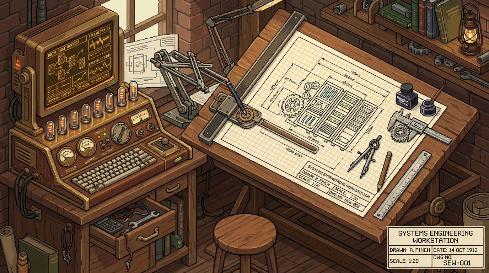

<div align="center">

  <!-- 3D ISOMETRIC PIXEL ART WORKSTATION // 1900s TECHNICAL DRAFTING -->
  

  <br/><br/>

  <!-- TYPING TECHNICAL TELEMETRY -->
  <a href="https://github.com/CHATDOO">
    
  </a>

  <br/>

  <!-- TECHNICAL DRAFTING STATUS BADGES -->
  <p align="center">
    <a href="https://github.com/CHATDOO">
      
    </a>
    <a href="https://hub.docker.com/u/shadowyt">
      
    </a>
    
    
  </p>

</div>

<br/>

### 📐 ❮ SPECIFICATION SHEET // SYSTEM BLUEPRINT ❯

```yaml
╔══════════════════════════════════════════════════════════════════════════════════════╗
║  PLATE NO. 01 · SYSTEMS ARCHITECTURE & INFRASTRUCTURE DRAFTING BOARD · EST. 1912     ║
╠══════════════════════════════════════════════════════════════════════════════════════╣
║  OPERATOR    : Salem Assadi (CHATDOO)          SCALE      : 1:1 REAL-TIME DRAFT      ║
║  DISCIPLINE  : Systems Architect & DevOps      STATUS     : [ CERTIFIED AIRWORTHY ]  ║
╚══════════════════════════════════════════════════════════════════════════════════════╝

# ─── CORE TELEMETRY & ARCHITECTURAL LOG ──────────────────────────────────────────────
Operator        : Salem Assadi
Directives      : High-Availability Game Topologies & Resilient Cloud Nodes
Virtualization  : Proxmox VE · LXC Containerization · Bare-Metal Clusters · Docker
Orchestration   : Pterodactyl Panel (Wine/Proton Layer, FiveM Gen9, Assetto Corsa Evo)
Automation & AI : Autonomous AI Agents · Telemetry Calculators · Custom Launchers
Computer Vision : YOLOv5 Real-time Object Detection Pipeline
Base Runtimes   : Linux (Debian / Ubuntu) · Bash · Python · TypeScript · Lua · Node.js
Equilibrium     : 0% Packet Loss · Optimized IOPS · Stable Buoyancy & High Flight Ceiling
```

---

### ⚙️ ❮ TECHNICAL PLATES // HIGHLIGHTED REPOSITORIES ❯

| Plate | Specification & Description | Core Architecture | Source |
| :--- | :--- | :--- | :---: |
| **PLATE I** | **Assetto Corsa Evo Server Egg**<br/><sub>Production-grade Pterodactyl Egg engineered for AC Evo dedicated servers with Wine/Proton multi-threading and automated pipelines.</sub> | `Pterodactyl` `Proton/Wine` `Docker` | [**Examine**](https://github.com/CHATDOO/acevo-server) |
| **PLATE II** | **FiveM GTA V Gen9 Enhanced Egg**<br/><sub>High-performance Linux egg for FiveM Gen9 builds with native <code>sv_enforceGameBuild</code>, txAdmin, and FXServer artifact automation.</sub> | `FiveM` `txAdmin` `Linux` | [**Examine**](https://github.com/CHATDOO/Pterodactyl-Egg-FiveM-GTA-V-EnhancedEdition) |
| **PLATE III** | **BeamNG CareerMP Framework**<br/><sub>Novel multiplayer synchronization framework porting BeamNG.drive's singleplayer Career Mode into BeamMP multiplayer servers.</sub> | `Lua` `BeamMP` `Multiplayer` | [**Examine**](https://github.com/CHATDOO/CareerMP) |
| **PLATE IV** | **rx-Launcher Desktop Suite**<br/><sub>Modular desktop launcher for modded Minecraft environments featuring isolated sandbox instances and dependency resolution.</sub> | `Electron.js` `Node.js` `API` | [**Examine**](https://github.com/CHATDOO/rx-Launcher) |

---

### 🛠️ ❮ ENGINEERING ARSENAL // TOOLING ❯

<div align="center">

  #### 🎛️ Infrastructure, Hypervisors & Virtualization
  <p>
    
  </p>

  #### ✒️ Programming Languages & Frameworks
  <p>
    
  </p>

  #### 🔬 Engineering, Artificial Intelligence & DevOps
  <p>
    
  </p>

</div>

---

### 📊 ❮ DRAFTING TELEMETRY // METRICS ❯

<p align="center">
  
  
</p>

<br/>

<div align="center">
  <sub>⚙️ <b>Salem Assadi (CHATDOO)</b> · Systems Engineering & Architectural Drafting Plate · All Rights Reserved ⚙️</sub>
</div>
